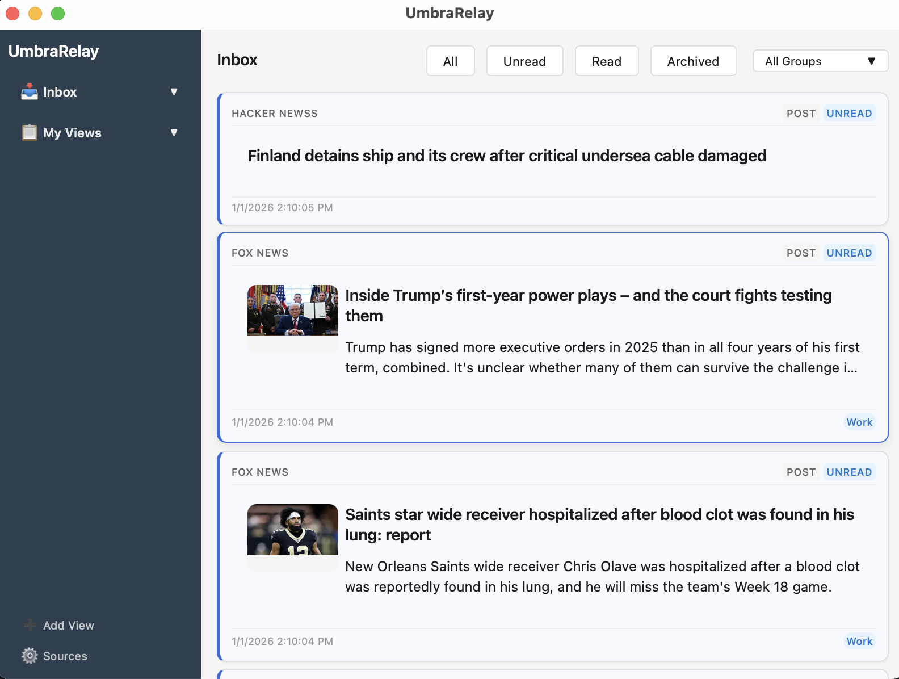

# UmbraRelay

A local-first desktop inbox aggregator that runs entirely on your machine.

## Overview

UmbraRelay aggregates RSS feeds and GitHub issues/PRs into a unified inbox. All data lives on your machine—no external databases, no cloud services, no tracking.

**Umbra** = shadow/quiet (your data stays private)  
**Relay** = passing signals forward (aggregating information)

## Key Features

- **Unified Inbox**: Single interface for RSS feeds and GitHub issues/PRs
- **Local-First**: All data stored locally in SQLite—your data never leaves your machine
- **Privacy-Focused**: No cloud services, no tracking, no external dependencies
- **Intuitive UI**: Easy-to-use interface for managing sources and settings
- **Automatic Sync**: Background polling keeps your inbox up to date
- **Custom Views**: Organize and filter items to match your workflow

## Quick Start

Get started with UmbraRelay in minutes:

1. **Install** - See the [Installation Guide](documentation/getting-started/installation.md)
2. **Configure** - Add your RSS feeds and GitHub repositories
3. **Sync** - Let UmbraRelay aggregate your sources
4. **Browse** - View everything in your unified inbox

For detailed instructions, see the [Getting Started Guide](documentation/getting-started/).

## Documentation

Comprehensive documentation is available in the [`documentation/`](documentation/) folder:

- **[Getting Started](documentation/getting-started/)** - Installation and basic usage
- **[User Guide](documentation/user-guide/)** - Detailed feature documentation
- **[Technical Docs](documentation/technical/)** - Architecture and development
- **[Examples](documentation/examples/)** - Configuration examples and use cases

## Tech Stack

Built with modern, privacy-respecting technologies:

- **Frontend**: Vue 3 + TypeScript + Vite
- **Backend**: Rust + Tauri
- **Database**: SQLite (embedded)
- **Communication**: Tauri commands (IPC)

## Development

For development setup and contribution guidelines, see the [Development Guide](documentation/technical/development.md).

## License

Pending - All rights reserved I guess for now.

## Contributing

Contributions welcome! See the [Development Guide](documentation/technical/development.md) for details.
